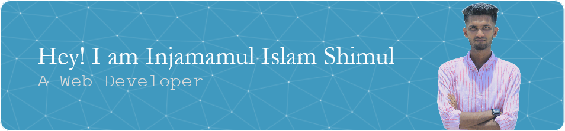

# 😎 About Me
I am a student of Computer Science. As you can tell by looking at my profile, currently I am learning Web Development.
I am looking forward to be an expert in building websites, softwares and probably my own programming language!

## 🤝 Socials
  

# 💻 Tech Stack
              

## 🏆 GitHub Trophies

# 📊 GitHub Stats

### 🔝 Top Contributed Repo

### ✍️ Random Dev Quote

---

